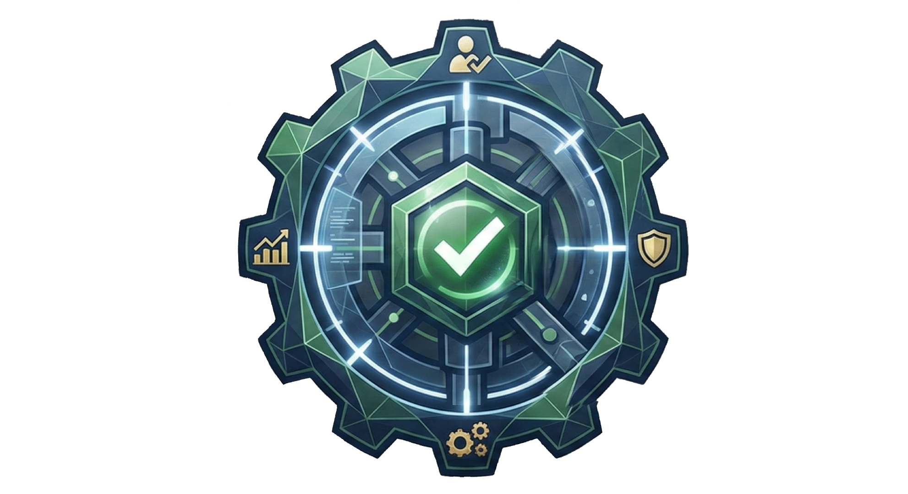

# CompVault



[](https://github.com/aliman00/CompVault/actions/workflows/build-and-test.yml)
[](https://github.com/aliman00/CompVault/actions/workflows/docker-build-push.yml)

Kompetanse- og HMS-portal for effektiv styring av opplæring, sertifikater og verneutstyr.

## Om prosjektet

CompVault er en webbasert løsning som automatiserer oppfølging av HMS-opplæring, kompetansebevis og utstyrslogging. Systemet sikrer at bedriften overholder lovkrav gjennom dokumenterte signaturer, proaktive varslinger og strukturert onboarding.

## Teknologistack

| Lag | Teknologi |
|---|---|
| Backend | ASP.NET Core Web API (.NET 10) |
| Frontend | Blazor Server |
| Database | PostgreSQL |
| ORM | Entity Framework Core |
| UI | MudBlazor |
| Testing | xUnit + Moq |

## Prosjektstruktur

```
CompVault/
├── CompVault.Backend/    # ASP.NET Core Web API
├── CompVault.Frontend/   # Blazor Server
├── CompVault.Shared/     # Delte klasser
├── CompVault.Tests/      # xUnit tester
└── docs/               # Prosjektdokumentasjon
```

## Docker Images

Ferdige images publiseres automatisk til GitHub Container Registry ved push til `main`.

| Image | Pull-kommando |
|---|---|
| Backend | `docker pull ghcr.io/aliman00/compvault-backend:latest` |
| Frontend | `docker pull ghcr.io/aliman00/compvault-frontend:latest` |

## Komme i gang

### Forutsetninger

- .NET 10 SDK
- Docker Desktop
- PostgreSQL

### Installasjon

1. Klon repo:
   ```bash
   git clone https://github.com/aliman00/CompVault.git
   cd CompVault
   ```

2. Start database:
   ```bash
   docker-compose up -d
   ```

3. Kjør migrasjoner:
   ```bash
   cd CompVault.Backend
   dotnet ef database update
   ```

4. Start applikasjon:
   ```bash
   dotnet run
   ```

## Team

| Rolle | Navn |
|---|---|
| Student 1 | Fredrik Magee |
| Student 2 | Almin Colakovic |
| Student 3 | Majlinda Lajci |

## Dokumentasjon

Se [prosjektplan](./docs/kommerEtterHvert.md) for fullstendig kravspesifikasjon og arkitektur.
